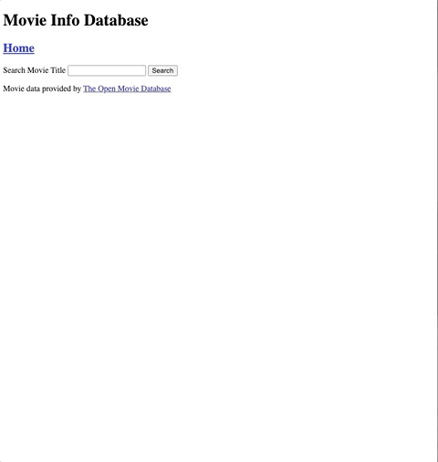

# Movie Info

This project allows users to search for a movie, see details about a specific movie, and vote on it.

## Technologies Used

This app is created with the following technologies:

### Frontend

- HTML
- Javascript
- jQuery version: 3.5.1
- Nunjucks version: 3.2.2
- Axios

### Backend

- Express version: 4.17.1
- Axios version: 0.21.1
- mysql2 version: 2.2.5

This app utilizes the following API for movie data:
- [The Open Movie Database API](http://www.omdbapi.com/)

## Set Up

This project requires an API key for The Open Movie Database which is not included in this repo. Please follow the instructions below to obtain one and include it in the correct file.

You must also have mySQL installed locally.

1. Clone the repository

2. In the terminal log into mySQL and create 'YearOne' database by typing, 'CREATE DATABASE YearOne;'

From the project root directory in the terminal, input the following commands:

3. `npm install` to install the necessary dependencies.

4. `mysql -u root -p YearOne < data.sql` to set up the database. Update username if necessary if it's not 'root'.

5. Create a .env file to contain your API key and mySQL password.

6. Add API_KEY=yourAPIkey and PASSWORD=yourmySQLpassword to the .env file. If you need to obtain an API key, you can do so [here](http://www.omdbapi.com/apikey.aspx).

7. `npm start server.js` to start the server, which should start at `localhost:3000`

